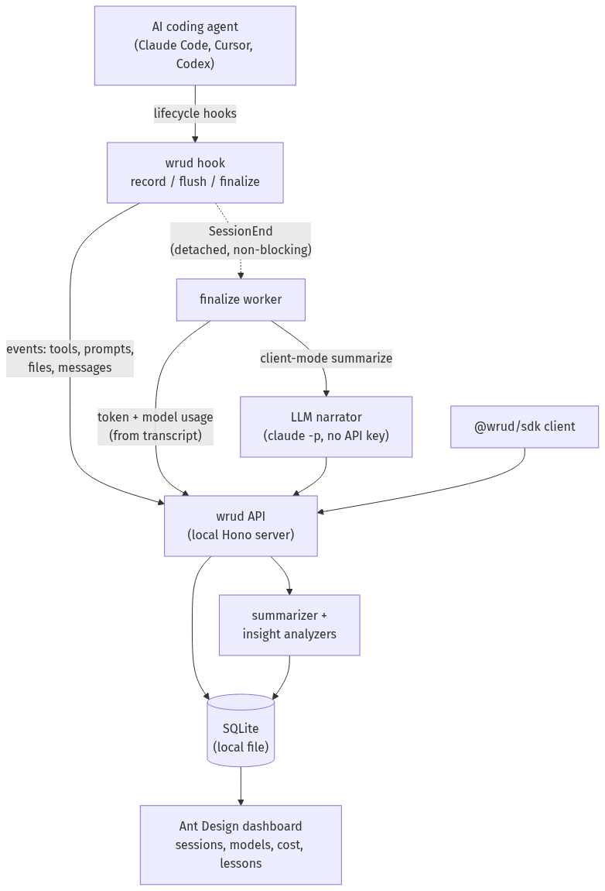

<div align="center">

# wrud - _What R U Doing_

**A local-first, API-first recorder for AI-agent sessions.**
See what your coding agent actually did - every tool, model, file, and error - turned into a
queryable session with a summary, cost signals, and lessons.

[](https://www.npmjs.com/package/@wrud/cli)
[](LICENSE)


[](https://github.com/eliransu/wrud/actions/workflows/ci.yml)

</div>

---

wrud records the lifecycle of an AI-agent session (Claude Code, Cursor, Codex, your own SDK
runs) and turns it into a queryable **Session** entity with a deterministic summary. It exists
to answer four questions:

1. **Understand the session** - what did the agent do, in what order, and how did it end?
2. **Right-size the model** - was a frontier model used for a one-line rename? Surface it.
3. **Teach the agent** - turn recurring mistakes into _lessons_ you feed back as memory.
4. **See it across a team/org** - roll every session up into one overview.

Everything runs on your machine: a local Node server and a local SQLite file. **No cloud
account, no telemetry leaving your box.** Hosted adapters (Postgres/Cloudflare) are optional
future work behind the same interfaces.

---

## How it works

<div align="center">
  
</div>

Your agent's lifecycle hooks capture the session (tools, prompts, files, messages) and stream
events to a local API. At session end a detached, non-blocking worker reads model/token usage and
writes a summary via a local narrator CLI (no API key). The API persists everything to local
SQLite and runs the summarizer plus insight analyzers; the Ant Design dashboard reads it back.
Source for the diagram: [`docs/architecture.mmd`](docs/architecture.mmd).

---

## Install and run

```bash
npx @wrud/cli
```

That's it - no clone, no token, no cloud account. It starts the API **and** dashboard on one
port (`http://localhost:8787`), seeds a local API key, opens your browser, and prints the
token to paste on the **Connect** screen:

```
  +------------------------------------------------------------------+
  |  wrud is running                                                   |
  +------------------------------------------------------------------+
   Open      : http://localhost:8787   (opening in your browser)
   API docs  : http://localhost:8787/docs        -   DB: ~/.wrud/wrud.db

   Paste this token on the Connect screen:

       wrud_sk_local_...

   Ctrl+C to stop.
```

State lives in `~/.wrud` and the token is reused across runs. Prefer a global command?
`npm i -g @wrud/cli` gives you `wrud`.

---

## Or: copy this to your AI assistant

Paste this block into Claude Code, Cursor, Codex, or any coding agent. It gets wrud running,
hands you your token, **and wires that agent's own lifecycle hooks so your sessions get
recorded** - adapting to whichever agent is reading it.

```text
Set up wrud for me - a local-first recorder for AI-agent sessions.

1. Run `npx @wrud/cli` in the BACKGROUND (it's a long-running server - don't block on it).
2. Read its output. When you see the "wrud is running" banner, tell me the `wrud_sk_local_...`
   token it printed and confirm http://localhost:8787 is reachable (GET /health -> {"ok":true}).
   It opens the dashboard in my browser automatically; if it didn't, give me the URL.
3. Tell me to paste that token on the dashboard's Connect screen - then I can see my sessions,
   model usage, cost signals, and insights.

Then make my sessions record automatically:
4. Work out which coding agent you are running inside, then run
   `npx @wrud/cli install-hooks --agent <that-agent> --user` (supported agents: claude-code,
   cursor). It mints a least-privilege ingest key, wires that agent's hooks at USER level (all my
   projects), and self-verifies - no manual config editing, no token to find. Use `--project` for
   just this repo. If my agent isn't supported, tell me instead of guessing.
5. Run `npx @wrud/cli doctor` and show me the result - it proves capture works end-to-end.
   Keep my wrud token out of anything that gets committed or shared.
```

> **user level vs project level?** Recording is about _you_, not a repo - you almost always want
> **user level** (`--user`, the agent's home config) so every session is captured wherever you
> work. Use **project level** (`--project`, the repo's agent config) only to record one shared
> repo for a team.

---

## What you get in the dashboard

Open `http://localhost:8787`, paste your token on **Connect**, and you have:

| Section      | What it shows                                                                         |
| ------------ | ------------------------------------------------------------------------------------- |
| **Overview** | Org rollup - session counts, per-model token usage, insight + lesson totals           |
| **Sessions** | Table with per-session input/output tokens; click in for the full detail view         |
| **Session**  | Narrative summary, stats, models, **skills & commands used**, signals, full event log |
| **API Keys** | Generate keys (secret shown once), list, revoke - scoped `ingest` / `read` / `admin`  |
| **Lessons**  | Memory-teaching guidance derived from insights across sessions                        |

---

## Record your own agent sessions

One command per agent. Pick yours:

```bash
npx @wrud/cli install-hooks --agent claude-code --user   # or --agent cursor
npx @wrud/cli doctor                                      # prove capture works end-to-end
```

| Agent         | Setup guide                                            |
| ------------- | ------------------------------------------------------ |
| Claude Code   | [`providers/claude-code.md`](providers/claude-code.md) |
| Cursor (1.7+) | [`providers/cursor.md`](providers/cursor.md)           |

`install-hooks` mints a **least-privilege ingest key** (stored `0600`), wires the agent's hooks
into its config (user or project), warns if a duplicate set exists in the other scope, and
self-verifies. The hooks capture prompts, tool calls **with content**, assistant responses, and
**model/token usage**, plus skills/commands used. On session end a **detached, non-blocking**
worker summarizes the session with a local narrator (`WRUD_NARRATOR_CMD`, default `claude -p`,
no API key, recursion-guarded), falling back to a deterministic summary if it isn't available.

> Cursor reports the model name on every hook (so model usage is captured); token/cost numbers
> for Cursor are deferred until its transcript format is known. Claude Code captures full tokens.

> Hit a 401, recorded nothing, or unsure which token/DB is in play? **`wrud doctor`** runs
> create->append->summarize->read against the live server and prints PASS/FAIL + HTTP status - no
> reverse-engineering. The CLI logs every hook failure to `~/.wrud/hooks.log` (never silent).

### CLI reference

Run via `npx @wrud/cli <command>`, or `npm i -g @wrud/cli` once and use the `wrud` command.

| Command                                                 | Does                                                                 |
| ------------------------------------------------------- | -------------------------------------------------------------------- |
| `wrud`                                                  | Start the API + dashboard on one origin; attaches if already running |
| `wrud doctor`                                           | End-to-end self-test (PASS/FAIL + HTTP status, DB, token)            |
| `wrud install-hooks [--agent <id>] [--user\|--project]` | Mint ingest key, wire that agent's hooks, self-verify                |
| `wrud hook <record\|flush\|finalize> [--provider <id>]` | Hook handlers (invoked by the agent's config)                        |

### Adding another agent

Any agent with lifecycle hooks, or that you can wrap with the
[`@wrud/sdk`](packages/sdk/README.md) client, can feed wrud. Adding one is a single entry in the
provider registry (`packages/cli/src/providers.ts`: config path, event map, payload map) plus a
`providers/<id>.md` doc - no changes to the API, SDK, or dashboard.

---

## SDK usage

Full reference: [`packages/sdk/README.md`](packages/sdk/README.md).

```ts
import { createWrudClient } from "@wrud/sdk";

const client = createWrudClient({
  baseUrl: "http://localhost:8787",
  apiKey: process.env.WRUD_API_KEY!,
});

const session = await client.startSession({
  user: { id: "u1" },
  agent: { name: "my-agent" },
});
session.event({ type: "tool_call", name: "Edit", ok: true, durationMs: 12 });
session.event({
  type: "model_use",
  model: "claude-opus-4-8",
  outputTokens: 320,
  task: "rename var",
});
const summary = await session.summarize(); // flushes buffered events, returns the summary
```

`event()` never throws into your agent - malformed events are validated, dropped, and counted
(`session.droppedCount`).

---

## API (v1)

| method | path                                | scope  | purpose                             |
| ------ | ----------------------------------- | ------ | ----------------------------------- |
| POST   | `/v1/sessions`                      | ingest | create a session                    |
| POST   | `/v1/sessions/{id}/events`          | ingest | append events (idempotent on `seq`) |
| POST   | `/v1/sessions/{id}/summarize`       | ingest | finalize + summarize                |
| GET    | `/v1/sessions`                      | read   | list sessions (with token totals)   |
| GET    | `/v1/sessions/{id}`                 | read   | session + summary                   |
| GET    | `/v1/sessions/{id}/events`          | read   | session events                      |
| GET    | `/v1/lessons`                       | read   | memory-teaching lessons             |
| GET    | `/v1/stats/overview`                | read   | enterprise rollup across sessions   |
| POST   | `/v1/keys`                          | admin  | create key (secret shown once)      |
| GET    | `/v1/keys`                          | admin  | list keys (no secrets)              |
| DELETE | `/v1/keys/{id}`                     | admin  | revoke a key                        |
| GET    | `/health`, `/openapi.json`, `/docs` | -      | meta (no auth)                      |

Auth: `Authorization: Bearer <key>` or `x-api-key: <key>`. Keys are stored only as SHA-256
hashes; the plaintext is shown once at creation. Browse the live spec at
`http://localhost:8787/docs`.

---

## Layout

```
packages/shared   zod schemas + types + strategy interfaces (the contract; OpenAPI source)
packages/server   Hono app, storage (Memory + SQLite), auth, summarizer + insights, Node entry
packages/sdk      @wrud/sdk client (generic, provider-agnostic)
packages/cli      the published `@wrud/cli` package - `npx @wrud/cli`; provider registry lives here
apps/platform     Ant Design web platform (Vite + React) - keys, sessions, insights, lessons, overview
providers/        per-agent reference docs (claude-code.md, cursor.md) for the copy-to-AI prompts
bin/wrud.mjs      dev launcher (npm run wrud) - API + Vite dashboard with hot reload, from source
```

Design + plan live in [`docs/design.md`](docs/design.md) and
[`docs/implementation-plan.md`](docs/implementation-plan.md).

---

## From source (contributors)

```bash
git clone https://github.com/eliransu/wrud.git && cd wrud && npm install
npm run wrud                  # dev launcher: API :8787 + Vite dashboard :5173 (hot reload)
npm -w packages/cli run build # build the publishable CLI -> packages/cli/dist (cli.mjs + web/)
```

**Publishing a new version (maintainer)** - to public npm, with an npm token that can publish
under the `@wrud` scope:

```bash
npm version patch -w packages/cli            # bump @wrud/cli
npm publish -w packages/cli --access public  # prepublishOnly rebuilds dist; goes to npmjs.org
```

Or run the pieces individually:

```bash
WRUD_DB=./wrud.db npm run seed:key                                # bootstrap admin key (shown once)
WRUD_DB=./wrud.db npm run serve                                   # API on :8787
VITE_WRUD_API=http://localhost:8787 npm -w @wrud/platform run dev # dashboard on :5173
```

### Server env vars

| var                   | default                                       | meaning                                                             |
| --------------------- | --------------------------------------------- | ------------------------------------------------------------------- |
| `WRUD_DB`             | `./wrud.db`                                   | SQLite file path (`:memory:` for ephemeral)                         |
| `WRUD_PORT`           | `8787`                                        | HTTP port                                                           |
| `WRUD_RATE_LIMIT`     | `120`                                         | requests per window per key                                         |
| `WRUD_RATE_WINDOW_MS` | `60000`                                       | rate-limit window                                                   |
| `WRUD_ANTHROPIC_KEY`  | _(unset)_                                     | when set, adds an LLM narrative to summaries (Haiku); safe fallback |
| `WRUD_CORS_ORIGIN`    | `http://localhost:5173,http://localhost:4173` | comma-separated browser origins allowed for the platform            |

`npx @wrud/cli` overrides: `WRUD_PORT`, `WRUD_DB` (default `~/.wrud/wrud.db`),
`WRUD_TOKEN_FILE` (default `~/.wrud/token`). The dev launcher (`npm run wrud`) also takes
`WRUD_WEB_PORT`.

---

## Development

```bash
npm test                              # vitest (unit + integration, in-process)
npm run typecheck                     # tsc --noEmit, server workspace
npm -w @wrud/platform run typecheck   # tsc --noEmit, platform
npm run e2e                           # Playwright: boots API + platform, runs API + browser UI tests
```

## Status - all phases shipped

| Phase | Scope                                                                       | Status |
| ----- | --------------------------------------------------------------------------- | ------ |
| 1     | API core + local storage + API-key auth + deterministic summarizer + SDK    | done   |
| 2     | Insight analyzers (model right-sizing, error rate) + optional LLM narrative | done   |
| 3     | Ant Design platform (keys, sessions, insights, overview)                    | done   |
| 4     | Lessons / memory-teaching + enterprise rollup (`/v1/stats/overview`)        | done   |

Hosted adapters (Cloudflare/D1/Postgres) remain optional future work behind the Phase 1
strategy interfaces.

## Contributing

PRs welcome. The shape of the project:

- **The contract is `packages/shared`** (zod schemas -> types -> OpenAPI). Change behavior there
  first, then the server, SDK, and platform follow.
- **Adapters implement an interface, not a vendor.** Storage (`StorageAdapter`), summarizer,
  and rate-limiter are swapped via DI in `buildApp({...})`. A new backend = a new adapter, no
  changes to the routes.
- **Leave a runnable check behind.** Anything you add should come with a test (`npm test`) or
  keep `npm run typecheck` / `npm run e2e` green.

Security issues: see [SECURITY.md](SECURITY.md) - please report privately.

## License

[MIT](LICENSE) (c) Eliran Suisa
