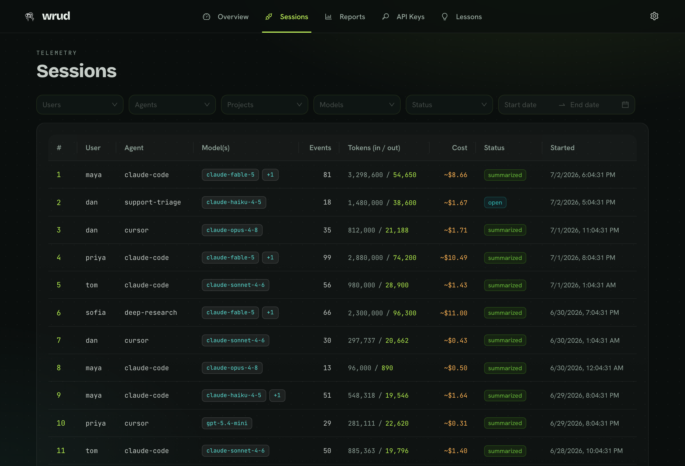
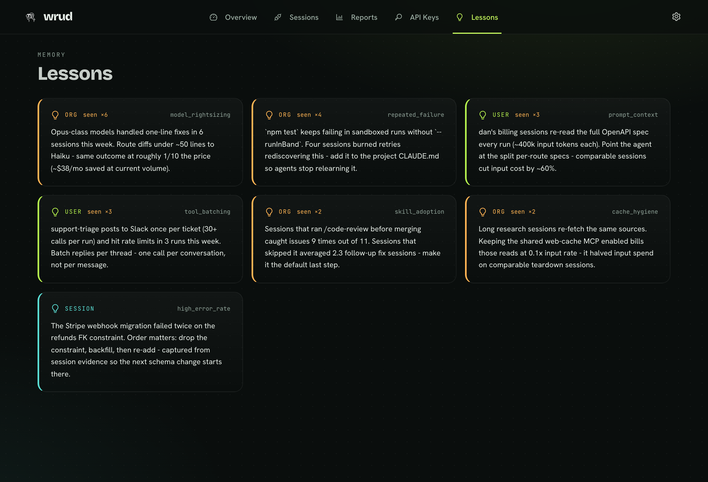

<div align="center">

<picture>
  <source media="(prefers-color-scheme: dark)" srcset="docs/assets/wrud-mascot-light.png" />
  
</picture>

# wrud

**What R U Doing** - a local-first, open-source recorder for AI-agent sessions.

[](https://www.npmjs.com/package/@wrud/cli)
[](LICENSE)


[](https://github.com/eliransu/wrud/actions/workflows/ci.yml)

</div>

---

Your agent runs for an hour - coding, researching, drafting - changes dozens of files, picks
its own model, makes the same mistake it made last Tuesday - then the session scrolls off and
is gone. wrud records it.

Every session is captured via the agent's own lifecycle hooks and written to a local SQLite
file: tools called, prompts submitted, file edits made, models used, tokens consumed per model,
and assistant responses. At session end a detached background worker reads the transcript and
writes a plain-language recap. Recurring patterns across sessions become **lessons** you can
feed back as agent memory.

It also flags where a **frontier model did trivial work** a smaller one could have done - so you
can right-size your model choices instead of paying top-tier rates to fix a typo.

**No cloud account. No telemetry. Nothing leaves your machine** - just `npx @wrud/cli`.

<div align="center">


</div>

---

## Quickstart

```bash
npx @wrud/cli
```

Starts the API and dashboard on one origin (`http://localhost:11190`), seeds a local API key,
opens your browser, and prints a token to paste on the Connect screen:

```
  +------------------------------------------------------------------+
  |  wrud is running                                                   |
  +------------------------------------------------------------------+
   Open      : http://localhost:11190   (opening in your browser)
   API docs  : http://localhost:11190/docs        -   DB: ~/.wrud/wrud.db

   Paste this token on the Connect screen:

       wrud_sk_local_...

   Ctrl+C to stop.
```

Then wire your agent and verify the capture path:

```bash
npx @wrud/cli install-hooks   # auto-detects every installed agent and wires them all
npx @wrud/cli doctor          # end-to-end self-test: PASS/FAIL + HTTP status
```

Restart your agent so it picks up the new hooks. That is all.

Prefer a global command? `npm i -g @wrud/cli` gives you `wrud`.

---

## How it works

Your agent fires its lifecycle hooks (SessionStart, PostToolUse, SessionEnd, etc.) into wrud's
local HTTP API. The API appends events to the session record in SQLite. On session end, a
detached non-blocking worker reads the collected transcript, runs insight analyzers (model
right-sizing, error rate), and writes a structured summary. The Ant Design dashboard reads
everything back from the same local API.

```
agent lifecycle hook
  -> POST /v1/sessions/{id}/events   (local HTTP, ingest key)
  -> SQLite (~/.wrud/wrud.db)
  -> summarizer worker (detached, no extra API key)
  -> GET /v1/sessions, /v1/lessons   (dashboard)
```

Source diagram: [`docs/architecture.mmd`](docs/architecture.mmd)

---

## Supported agents

| Agent       | Hook mechanism                  | Tokens captured                          | Setup guide                                            |
| ----------- | ------------------------------- | ---------------------------------------- | ------------------------------------------------------ |
| Claude Code | `~/.claude/settings.json` hooks | Full (per model)                         | [`providers/claude-code.md`](providers/claude-code.md) |
| Cursor 1.7+ | `~/.cursor/hooks.json`          | Model name only (token numbers deferred) | [`providers/cursor.md`](providers/cursor.md)           |

The hooks fire whatever the work is - the same capture whether your agent is shipping code,
drafting campaign copy, or cleaning a spreadsheet. Recording is about the agent, not the task.

Adding another agent is a single entry in the provider registry
(`packages/cli/src/providers.ts`) - config path, event map, payload normalization - plus a
`providers/<id>.md` doc. No changes to the API, SDK, or dashboard.

---

## Commands

Run via `npx @wrud/cli <command>` or `wrud <command>` if installed globally.

| Command                                                 | What it does                                                                                                                                                                                                                     |
| ------------------------------------------------------- | -------------------------------------------------------------------------------------------------------------------------------------------------------------------------------------------------------------------------------- |
| `wrud`                                                  | Start the API + dashboard on one origin. Attaches if already running.                                                                                                                                                            |
| `wrud install-hooks [--agent <id>] [--user\|--project]` | Auto-detect and wire every installed agent (or target one with `--agent claude-code` / `--agent cursor`). Mints a least-privilege ingest key, writes the hook config, self-verifies.                                             |
| `wrud doctor`                                           | End-to-end self-test: create -> append -> summarize -> read against the live server. Prints PASS/FAIL and HTTP status.                                                                                                           |
| `wrud stop`                                             | Stop the running server (on `WRUD_PORT`). Also used internally by `cleanup`.                                                                                                                                                     |
| `wrud cleanup` (alias `uninstall`)                      | Remove everything wrud installed: `~/.wrud` (db, tokens, log), temp session buffers, wrud's hook entries in every agent's config. Edits shared config surgically. `--dry-run` previews; confirms before deleting unless `--yes`. |
| `wrud hook <record\|flush\|finalize> [--provider <id>]` | Hook handlers called by the agent's config. Not for direct use.                                                                                                                                                                  |

**User scope vs. project scope:** Recording is about you, not a repo - use `--user` (the
default) so every session is captured wherever you work. Use `--project` only to record one
shared repo for a team.

---

## Configuration

| Variable              | Default                                         | Purpose                                                                                                                        |
| --------------------- | ----------------------------------------------- | ------------------------------------------------------------------------------------------------------------------------------ |
| `WRUD_PORT`           | `11190`                                         | API/server port. The dashboard is served same-origin.                                                                          |
| `WRUD_DB`             | `~/.wrud/wrud.db`                               | SQLite file path. `:memory:` for ephemeral.                                                                                    |
| `WRUD_BASE_URL`       | `http://localhost:11190`                        | Base URL the hooks and CLI talk to.                                                                                            |
| `WRUD_API_KEY`        | -                                               | Ingest token override (else read from `~/.wrud`).                                                                              |
| `WRUD_NARRATOR_CMD`   | `claude`                                        | CLI used for the plain-language recap. Runs on your existing agent login - no extra API key.                                   |
| `WRUD_ANTHROPIC_KEY`  | -                                               | Optional: use the Anthropic API for the recap instead of the local narrator. Falls back to the deterministic summary if unset. |
| `WRUD_RATE_LIMIT`     | `120`                                           | Requests per rate-limit window per key.                                                                                        |
| `WRUD_RATE_WINDOW_MS` | `60000`                                         | Rate-limit window in milliseconds.                                                                                             |
| `WRUD_CORS_ORIGIN`    | `http://localhost:11191,http://localhost:11192` | Browser origins allowed for the platform (dev only; production is same-origin).                                                |

State lives in `~/.wrud`. The token is reused across runs.

---

## Dashboard

Open `http://localhost:11190` and paste your token on the Connect screen.

<table>
<tr>
<td width="50%"><br/><sub><b>Sessions</b> - filter by user, agent, model, date; per-session tokens and model breakdown.</sub></td>
<td width="50%"><br/><sub><b>Lessons</b> - memory-teaching guidance from recurring patterns (e.g. model right-sizing).</sub></td>
</tr>
</table>

| Section        | What it shows                                                                                                         |
| -------------- | --------------------------------------------------------------------------------------------------------------------- |
| Overview       | Rollup across all sessions: session counts, per-model token usage, insight and lesson totals.                         |
| Sessions       | Table with per-session input/output tokens and model breakdown. Click in for the full detail view.                    |
| Session detail | Narrative recap, per-model token usage (and cost signals for right-sizing), skills and commands used, full event log. |
| Lessons        | Memory-teaching guidance derived from recurring patterns across sessions.                                             |
| API Keys       | Create keys (secret shown once), list, revoke. Scopes: `ingest`, `read`, `admin`.                                     |

**On tokens and cost signals:** wrud surfaces token counts per model, an approximate dollar
cost (`~$`) from a built-in list-price table, and flags sessions where a high-tier model was
used for a trivial task - useful for right-sizing your model choices. The `~$` figure is an
estimate: list prices only, cache discounts not modeled (cache-heavy sessions read as an upper
bound), and unknown models show no cost rather than a wrong one.

---

## Lessons

After enough sessions, `GET /v1/lessons` returns structured guidance derived from the insight
analyzers (model right-sizing, error rate, recurring patterns). The Lessons view in the dashboard
renders this as agent-memory text you can paste into your agent's system prompt or memory file.

---

## API

Auth: `Authorization: Bearer <key>` or `x-api-key: <key>`. Keys are stored as SHA-256 hashes;
the plaintext is shown once at creation. Browse the live spec at `http://localhost:11190/docs`.

| Method | Path                                | Scope  | Purpose                             |
| ------ | ----------------------------------- | ------ | ----------------------------------- |
| POST   | `/v1/sessions`                      | ingest | Create a session                    |
| POST   | `/v1/sessions/{id}/events`          | ingest | Append events (idempotent on `seq`) |
| POST   | `/v1/sessions/{id}/summarize`       | ingest | Finalize and summarize              |
| GET    | `/v1/sessions`                      | read   | List sessions with token totals     |
| GET    | `/v1/sessions/{id}`                 | read   | Session + summary                   |
| GET    | `/v1/sessions/{id}/events`          | read   | Session events                      |
| GET    | `/v1/lessons`                       | read   | Memory-teaching lessons             |
| GET    | `/v1/stats/overview`                | read   | Rollup across all sessions          |
| POST   | `/v1/keys`                          | admin  | Create key (secret shown once)      |
| GET    | `/v1/keys`                          | admin  | List keys (no secrets)              |
| DELETE | `/v1/keys/{id}`                     | admin  | Revoke a key                        |
| GET    | `/health`, `/openapi.json`, `/docs` | -      | Meta endpoints (no auth)            |

---

## SDK

For integrating your own agent or script. Full reference: [`packages/sdk/README.md`](packages/sdk/README.md). The CLI hooks use it under the hood, so for recording an agent you just run `install-hooks`; reach for the SDK to record your own automation.

> `@wrud/sdk` is not published to npm standalone yet - it ships inside `@wrud/cli` and lives in this repo. Use it from a clone for now.

```typescript
import { createWrudClient } from "@wrud/sdk";

const client = createWrudClient({
  baseUrl: "http://localhost:11190",
  apiKey: process.env.WRUD_API_KEY!,
});

const session = await client.startSession({
  user: { id: "u1" },
  agent: { name: "my-agent" },
});

session.event({ type: "tool_call", name: "Edit", ok: true, durationMs: 12 });
session.event({
  type: "model_use",
  model: "claude-opus-4",
  outputTokens: 320,
  task: "rename var",
});

const summary = await session.summarize(); // flushes buffered events, returns the summary
```

`event()` never throws into your agent - malformed events are validated, dropped, and counted
(`session.droppedCount`).

---

## Privacy

wrud is local-first by design. The server is a Node process on your machine. The database is a
single SQLite file at `~/.wrud/wrud.db`. The summary recap runs in the background using your
agent's existing login - no separate API key, no data sent to a third party by wrud itself.

`wrud cleanup` removes everything wrud ever wrote to disk.

---

## Repository layout

```
packages/shared   Zod schemas + types + strategy interfaces (the contract; OpenAPI source)
packages/server   Hono app, SQLite/Memory storage, auth, summarizer, insight analyzers
packages/sdk      @wrud/sdk client - typed start/event/summarize lifecycle
packages/cli      @wrud/cli (published) - provider registry, install-hooks, doctor, cleanup
apps/platform     Ant Design + Vite + React dashboard
providers/        Per-agent reference docs (claude-code.md, cursor.md)
docs/             Architecture diagram, design notes, implementation plan
bin/wrud.mjs      Dev launcher (npm run wrud) - API + Vite with hot reload
```

---

## Building from source

```bash
git clone https://github.com/eliransu/wrud.git
cd wrud
npm install
npm run wrud          # dev: API on :11190, Vite dashboard on :11191 (hot reload)
```

Build the publishable CLI:

```bash
npm -w packages/cli run build   # -> packages/cli/dist/cli.mjs + dist/web/
```

Run the test suite:

```bash
npm test                              # vitest: unit + integration (in-process, :memory: SQLite)
npm run typecheck                     # tsc --noEmit, server workspace
npm -w @wrud/platform run typecheck   # tsc --noEmit, platform
npm run e2e                           # Playwright: boots API + platform, API + browser UI tests
```

---

## Contributing

See [CONTRIBUTING.md](CONTRIBUTING.md) for the full guide. New here? Start with a
[**good first issue**](https://github.com/eliransu/wrud/labels/good%20first%20issue) - e.g. adding
a new agent provider is a single registry entry plus a doc. Short version:

- **The contract lives in `packages/shared`.** Change behavior there first (Zod schemas ->
  types -> OpenAPI); the server, SDK, and platform follow.
- **Adapters implement an interface, not a vendor.** `StorageAdapter`, summarizer, and
  rate-limiter are injected into `buildApp({...})`. A new backend is a new adapter - no changes
  to routes.
- **Leave a runnable check behind.** Additions should keep `npm test`, `npm run typecheck`,
  and `npm run e2e` green.

Security issues: report privately via [SECURITY.md](SECURITY.md).

---

## License

[MIT](LICENSE) (c) Eliran Suisa
